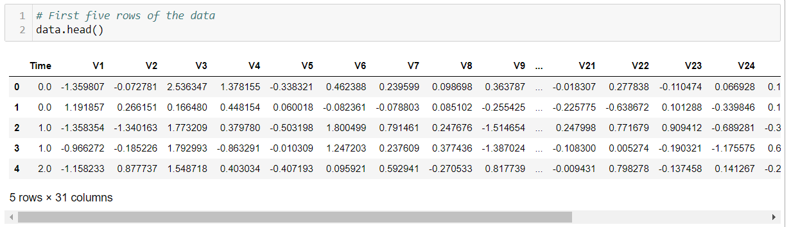

--- 
title: "Data Cleaning and Exploratory Data Analysis (EDA)"
date: 2023-01-25
---

## Data Cleaning
The first step of the data science pipeline is data cleaning. **Data cleaning** is the process of fixing or removing incorrect, duplicate, or incomplete data within a dataset. The dataset I am working with contains only numerical variables resulting from a principla component analysis (PCA) transformation.

### A Quick Snippet on PCA Transformation
A PCA transformation is a dimensionality-reduction method that transforms a large set of variables into a smaller one that still keeps most of the original information. Essentially, it reduces the number of variables while preserving as much information as possible ([builtin](https://builtin.com/data-science/step-step-explanation-principal-component-analysis)). Without going into too much of the mathematical details, PCA essentially uses the variance to quantify the amount and the parts of the data that is important. Data that has higher variance holds more information. 

Wikipedia defines PCA as

*an orthogonal linear transformation that transforms the data to a new coordinate system such that the greatest variance by some scalar projection of the data comes to lie on the first coordinate (called the first principal component), the second greatest variance on the second coordinate, and so on.*

This dataset collect and analyzed by Worldline and the [MLG](http://mlg.ulb.ac.be/) of ULB has already gone through a PCA transformation and been reduced down to 28 features. 'Time' and 'Amount' are the only features that has not been transformed. 

Upon initial analysis, the data I am working with here is clean. I've checked for null and duplicate values using **data.isnull().sum()** and **data.duplicated()**. All of the features are numerical variables labeled **V1, V2,..., V28**. However, because data cleaning is an iterative process it may be possible that I have to come back to this step again.

## Exploratory Data Analysis (EDA)
It's important to understand the data to gather as much insight as possible from it. This step is all about making sense of the data by looking for patterns, spotting anomalies, and checking assumptions through summary statistics and visualizations ([towardsdatascience](https://towardsdatascience.com/exploratory-data-analysis-8fc1cb20fd15)). 

After reading in thed data, I used the *.head()* function of the pandas library to look at the first five observations of my dataset. 

### Working with imbalanced data

